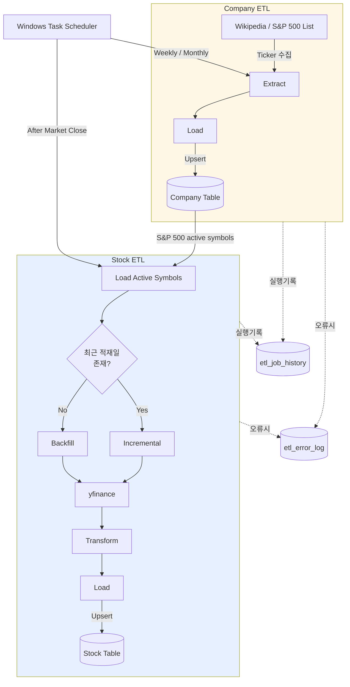
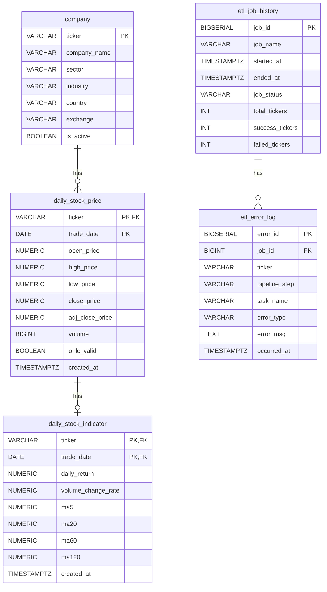

# 📈 Stock-Data-Pipeline

S&P 500 구성 종목의 일별 주가 데이터를 자동 수집하여 PostgreSQL에 적재하는 ETL 파이프라인입니다.

## 🎯 프로젝트 목적
- S&P 500 구성 종목의 일별 주가 데이터를 자동으로 수집하고 PostgreSQL에 적재하는 데이터 파이프라인입니다. 
단순 데이터 수집을 넘어 안정적인 ETL 운영을 목표로 Backfill 및 Incremental Load, 데이터 품질 검증, 재시도, 오류 로깅 등의 ETL 기능을 구현하는 것을 목표로 합니다.

## 🛠️ Tech Stack

### Data Pipeline & Logic
- **Python**
- **yfinance**
- **Pandas**

### Database & ORM
- **PostgreSQL**
- **SQLAlchemy**
- **psycopg2**

### Testing & Operations
- **Git / Github**
- **pytest**
- **dotenv**
- **Window Task Scheduler**

## Architecture


## Data Flow
```mermaid
flowchart LR
```

## DB Schema


- **is_active**: 현재 S&P 500 구성 종목과 과거 구성 종목을 구분하며, 구성에서 제외된 종목의 과거 데이터는 삭제하지 않는다.
- **ohlc_valid**: yfinance가 반환하는 원천 데이터의 OHLC 이상 여부를 기록하여, 이상 데이터를 삭제하지 않고 추적할 수 있도록 한다.
- **(ticker, trade_date) 복합 PK**: 종목별 거래일을 유일하게 식별하여 동일 종목의 동일 거래일 데이터 중복 적재를 방지한다.

## Backfill / Incremental 전략

## Data Quality

### 검증 항목
- **OHLC 관계 검증**: `high >= low`, `high >= open/close`, `low <= open/close` 조건을 검증한다. 조건을 만족하지 않는 데이터는 삭제하지 않고 `ohlc_valid = False`로 표시하여 원천 데이터의 이상 여부를 추적할 수 있도록 한다.
- **값의 범위 검증**: 가격과 거래량이 음수가 되지 않도록 DB CHECK 제약조건을 적용하여 비정상적인 값의 적재를 방지한다.
- **중복 데이터 방지**: `(ticker, trade_date)`를 복합 PK로 설정하여 동일 종목의 동일 거래일 데이터가 중복 저장되지 않도록 한다.

### 설계 원칙
- **원천 데이터 보존**: yfinance가 반환하는 값 자체가 잘못되는 경우가 있어 이상 데이터를 임의로 삭제하지 않고 검증 결과를 별도의 컬럼으로 기록한다.
- **Python + DB 이중 검증**: Python 변환 과정에서 데이터 유효성을 확인하고, DB 제약조건을 통해 최종 적재 단계에서도 데이터 무결성을 보장한다.
- **추적 가능성**: 데이터의 이상 여부를 별도로 기록하여 이후 원천 데이터 문제와 변환 로직 문제를 구분할 수 있도록 한다.

## Error Handling

## Retry

## 실행 방법

## 발견한 실제 문제와 해결 방법

## 한계 및 향후 개선 사항