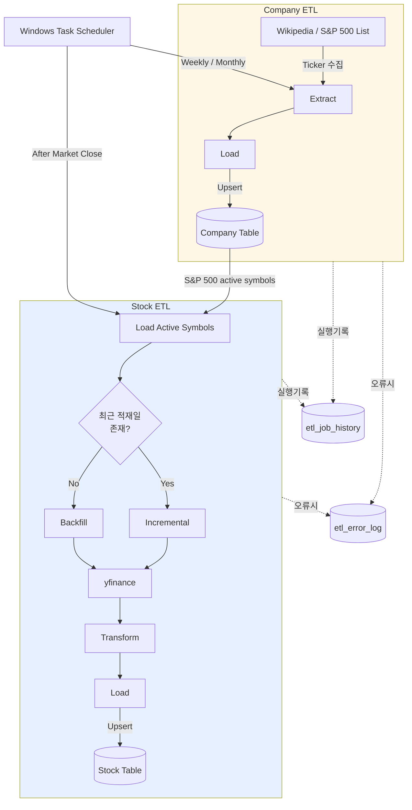
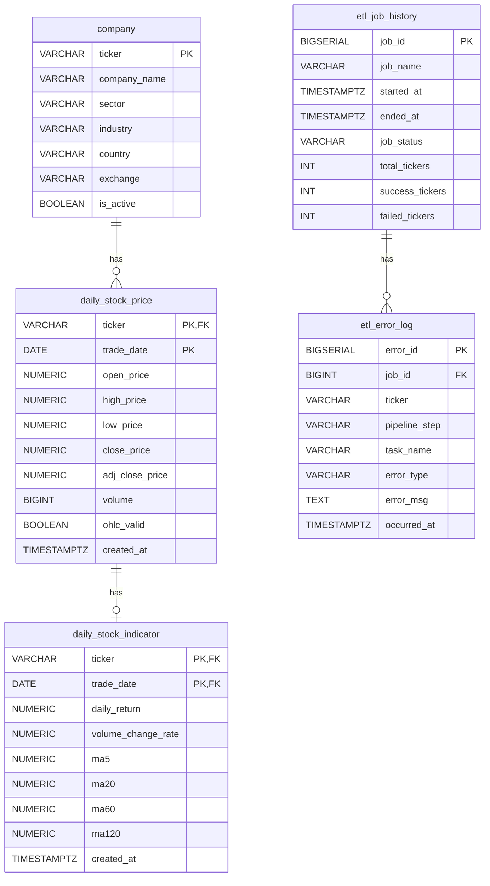

# 📈 Stock-Data-Pipeline

S&P 500 구성 종목의 일별 주가 데이터를 자동 수집하여 PostgreSQL에 적재하는 ETL 파이프라인입니다.

## 🎯 프로젝트 목적
- S&P 500 구성 종목의 일별 주가 데이터를 자동으로 수집하고 PostgreSQL에 적재하는 데이터 파이프라인입니다. 
단순 데이터 수집을 넘어 안정적인 ETL 운영을 목표로 Backfill 및 Incremental Load, 데이터 품질 검증, 재시도, 오류 로깅 등의 ETL 기능을 구현하는 것을 목표로 합니다.

## 🛠️ Tech Stack

### Data Pipeline & Logic
- **Python**
- **yfinance**
- **Pandas**

### Database & ORM
- **PostgreSQL**
- **SQLAlchemy**
- **psycopg2**

### Testing & Operations
- **Git / Github**
- **pytest**
- **dotenv**
- **Window Task Scheduler**

## Architecture


## Data Flow
```mermaid
flowchart LR
```

## DB Schema


- **is_active**: 현재 S&P 500 구성 종목과 과거 구성 종목을 구분하며, 구성에서 제외된 종목의 과거 데이터는 삭제하지 않는다.
- **ohlc_valid**: yfinance가 반환하는 원천 데이터의 OHLC 이상 여부를 기록하여, 이상 데이터를 삭제하지 않고 추적할 수 있도록 한다.
- **(ticker, trade_date) 복합 PK**: 종목별 거래일을 유일하게 식별하여 동일 종목의 동일 거래일 데이터 중복 적재를 방지한다.

## Backfill / Incremental 전략

## Data Quality

### 검증 항목
- **OHLC 관계 검증**: `high >= low`, `high >= open/close`, `low <= open/close` 조건을 검증한다. 조건을 만족하지 않는 데이터는 삭제하지 않고 `ohlc_valid = False`로 표시하여 원천 데이터의 이상 여부를 추적할 수 있도록 한다.
- **값의 범위 검증**: 가격과 거래량이 음수가 되지 않도록 DB CHECK 제약조건을 적용하여 비정상적인 값의 적재를 방지한다.
- **중복 데이터 방지**: `(ticker, trade_date)`를 복합 PK로 설정하여 동일 종목의 동일 거래일 데이터가 중복 저장되지 않도록 한다.

### 설계 원칙
- **원천 데이터 보존**: yfinance가 반환하는 값 자체가 잘못되는 경우가 있어 이상 데이터를 임의로 삭제하지 않고 검증 결과를 별도의 컬럼으로 기록한다.
- **Python + DB 이중 검증**: Python 변환 과정에서 데이터 유효성을 확인하고, DB 제약조건을 통해 최종 적재 단계에서도 데이터 무결성을 보장한다.
- **추적 가능성**: 데이터의 이상 여부를 별도로 기록하여 이후 원천 데이터 문제와 변환 로직 문제를 구분할 수 있도록 한다.

## Error Handling

### 기록 구조
- **ticker, task_name**: 오류가 발생한 종목과 작업을 식별한다. 종목과 무관한 전체 오류의 경우 `ticker`는 `NULL`로 기록한다.
- **pipeline_step**: `extract/transform/load` 중 어느 단계에서 오류가 발생했는지 기록하여 장애 원인을 빠르게 좁힐 수 있도록 한다.
- **error_type, error_msg**: 오류 유형과 상세 메세지를 남겨 재현 및 원인 분석에 활용한다.

### 설계 의도
`etl_job_history`는 ETL 실행 단위의 처리 결과를 요약하고, `etl_error_log`는 해당 실행 중 발생한 개별 오류의 상세 정보를 기록하도록 한다.
개별 종목의 실패가 전체 ETL 실행 실패로 이어지지 않도록 오류를 수집하고 다른 종목의 처리를 계속한다. 전체 작업은 성공한 종목과 실패한 종목의 결과에 따라 `success`, `partial_success`, `failed` 상태로 종료할 수 있도록 한다.
ETL 실행 중 발생한 오류는 `errors`에 수집한 후, 전체 ETL 실행이 완료되면 `etl_error_log`에 일괄 적재한다.

## Retry

### 재시도 대상
종목 단위(ticker)로 `yfinance API` 호출을 재시도 한다. 네트워크 타임아웃, rate limit(HTTP 429), 빈 데이터 반환 등의 일시적으로 발생할 수 있는 오류를 재시도 대상으로 한다.

### 재시도 정책
- **MAX_RETRIES = 3**: 동일 종목에 대해 최대 3회까지 시도한다.
- **RETRY_DELAY = 1**: 재시도 사이에 1초의 대기시간을 둔다.
- **최종 실패 처리**: 3회 모두 실패한 종목은 `errors`로 집계하고 해당 종목의 처리를 종료한다. 다른 종목의 처리는 계속하여 도중에 전체 ETL이 중단되지 않도록 한다.

## 실행 방법

### Installation
```bash
git clone https://github.com/wnjseo/stock-data-pipeline
cd stock-data-pipeline
python -m venv venv
venv\Scripts\activate
pip install -r requirements.txt
```

### Configuration
1. `.env.example`을 복사하여 `.env` 파일을 생성한다.
```bash
copy .env.example .env
```
2. `.env` 파일에 PostgreSQL 접속 정보를 입력한다.
```env
DB_HOST=localhost
DB_PORT=5432
DB_NAME=stock_etl
DB_USER=your_user
DB_PW=your_pw
```
3. 데이터베이스 스키마를 생성한다.
```bash
psql -U your_user -d stock_etl -f 01_create_tables.sql
```

### Run
> 최초 실행 시 `main_company.py`를 먼저 실행하여 회사 정보를 적재해야
> `main_stock.py`가 참조할 active 종목 목록이 생성된다.

Windows Task Scheduler에 main_company.py와 main_stock.py를 등록하여 주기적으로 실행할 수 있다.

```bash
# 회사 정보 ETL (주 1회 실행 권장)
python main_company.py

# 주가 ETL (장 마감 후 실행 권장)
python main_stock.py
```

## 발견한 실제 문제와 해결 방법

### yfinance MultiIndex 컬럼 반환
**문제**
`yfinance`가 단일 종목을 조회하더라도 MultiIndex 형태의 컬럼을 반환하여 기존 Transform 로직에서 컬럼을 정상적으로 참조하지 못하는 문제가 발생했다.
**해결 방법**
Extract 단계에서 MultiIndex 여부를 확인하고, MultiIndex인 경우 컬럼을 단일 레벨로 변환한 후 기존 Transform 로직을 수행하도록 처리했다.

### yfinance OHLC 정합성 오류
**문제**
백필 과정에서 `yfinance`가 반환한 데이터 중 1건에서 `open >= low`의 OHLC 정합성 조건을 만족하지 않는 데이터를 발견했다. 
**해결 방법**
OHLC 관계를 검증하고 조건을 만족하지 않는 데이터는 삭제하지 않고 `ohlc_valid = False`로 표시하여 추적할 수 있도록 했다.

### yfinance 과거 데이터 소급 정정 
**문제**
증분 수집 과정에서 기존에 `ohlc_valid = False`로 기록된 데이터를 다시 조회하였을 때, 일정 시간이 지난 후 해당 데이터가 `ohlc_valid = True`로 변경되는 것을 확인했다. 이를 통해 `yfinance`가 장마감 직후 반환한 과거 OHLC 데이터를 소급하여 정정할 수 있음을 발견했다.
**해결 방법**
증분 수집 시 최근 3일의 과거 데이터를 함께 재조회하고, 기존 데이터와 동일한 PK `(ticker, trade_date)`를 기준으로 `upsert`하여 이후 정정된 과거 데이터를 갱신할 수 있도록 했다. (관찰 결과 정정은 대부분 1일 내 발생하여 3일의 여유를 두었다)

### Volume = 0으로 인한 무한대(inf) 값
**문제**
수집 과정에서 거래량이 0인 종목이 존재하여 `volume_change_rate` 계산 과정에서 0으로 나누는 상황이 발생했고, 그 결과 `inf`가 생성되어 적재 과정에서 오류가 발생했다.
**해결 방법**
Transform 단계에서 `volume_change_rate` 계산 후 발생한 `inf` 값을 `NaN`으로 변환하여 적재 과정에서 오류가 발생하지 않도록 처리했다.

### S&P 500 구성 종목 변경 (합병)
**문제**
합병으로 종목이 변경된 경우, 합병 이전 종목의 ticker로 더 이상 OHLCV 데이터가 반환되지 않는 현상을 발견했다. 반면 신규 종목의 ticker로 조회하면 합병 이전 기업의 과거 데이터까지 함께 포함되어 있어, 종목과 실제 데이터 간 정합성이 어긋나는 문제가 발생했다.
**해결 방법**
합병일을 확인하여 신규 종목의 합병일 이전 데이터를 삭제하고, 합병일 이후 데이터만 유지하도록 일회성으로 수동 처리했다. 합병은 발생 빈도가 낮아 자동화 우선순위에서는 낮췄으나, 합병 이전 종목의 데이터 반환 중단을 감지 신호로 활용해 향후 자동 탐지 로직을 추가할 수 있다.

## 한계 및 향후 개선

### 한계
* **S&P 500 구성 종목 변경의 자동화 한계** 
  합병, 인수, 티커 변경, 상장폐지 등 S&P 500 구성 종목의 변경을 자동으로 처리하지 못하고 수동 처리에 의존한다.
* **로컬 실행 환경의 운영 한계**  
  현재 개인 PC의 Windows Task Scheduler를 통해 ETL을 실행하고 있어, PC 종료·절전이나 네트워크 단절이 발생하면 작업이 누락될 수 있다. 또한 원격 환경에서 ETL 상태를 모니터링하고 장애에 대응하기 어렵다.
* **기업 식별 모델의 한계**
  `company` 테이블이 ticker를 기업의 고유 식별자로 사용하고 있어, 합병·티커 변경·상장·상장폐지처럼 기업과 ticker의 관계가 변경되는 상황을 세밀하게 관리하기 어렵다.
* **외부 데이터 품질 검증의 한계**
  `yfinance`가 반환하는 데이터에는 논리적 OHLC 검증(`high >= low` 등)으로는 감지할 수 없는 오류가 존재할 수 있다. 따라서 데이터 소스 자체의 오류나 비정상적인 값을 완전히 보장하기에는 한계가 있다.

### 향후 개선
* `corporate_action` 데이터를 활용해 합병, 인수, 티커 변경, 상장폐지 등 S&P 500 구성 종목의 변경을 자동으로 처리한다.
* Docker를 도입하여 환경 의존성 문제를 해결하고, AWS 등의 클라우드 환경으로 이전하여 상시 실행 환경을 구성한다. 이후 Airflow를 도입하여 스케줄링, 재시도, 모니터링을 관리한다.
* `company`(기업)와 `security`(증권/ticker)를 분리하여, 기업과 ticker 간 이력이 변경되는 상황을 관리할 수 있도록 데이터 모델을 개선한다.
* 추가적인 데이터 품질 검증 규칙을 도입하거나, 필요에 따라 yfinance 외 대체 데이터 소스를 검토한다.